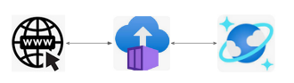

## This project is an Azure Container instance with an API that returns randomly a football player name and nationality and the football players are all the players of the WorldCup 2026.  It was great to make more experience and face real problems, look up to where i can go with my subscription.

* The list of football players and nationality was created also by me, i could not find a dataset in the web so i created it from scratch [WorldCup2026Players](tools/players.csv)

* Diagram




#### I recommend setting a python virtual environment, you can just use the cloudshell.  But it is not really required, only some tip.
```
python -m venv .venv
```
#### Installing some required packages
```
pip install azure-keyvault
pip install azure-cosmos
pip install azure-identity
```

#### Setting some variables
```
CN="playerone"
RG="test01"
COSMOSDB="test01account"
ACR="acrcordoba"
KVNAME="kvwc2026"
SUBID="you subscription id"

az group create -g $RG --location westus
```

#### Create the cosmos DB, then obtain the Keys and store it in the KV (created next)
```
az cosmosdb create -n "$COSMOSDB" \
-g $RG --enable-free-tier true \
--locations regionName="West US" \
--default-consistency-level "Session"
```

#### For this you  will need to have the Microsoft.DocumentDB namespace registered
```
az provider register --namespace Microsoft.DocumentDB
```

#### Create the Azure Container Registry we will use to store the image and also to build the Dockerfile
#### In Access keys > Admin user (enable) and copy the password (you will need it later)
```
az acr create --resource-group $RG --name $ACR --sku Basic
```

#### For this you  will need to have the Microsoft.ContainerRegistry namespace registered
```
az provider register --namespace Microsoft.ContainerRegistry
```

### Prepare Key Vault
#### Set the key for the cosmos DB into the keyvault.
#### And give the managed entity access to the keyvault to read the secret
```
az keyvault create --name "$KVNAME" --resource-group $RG --sku "standard"
```

#### For this you  will need to have the Microsoft.KeyVault namespace registered
```
az provider register --namespace Microsoft.KeyVault
```
#### Put in the keyvault the secret for the CosmosDb: cosmosdb and the secret (from previously when you created the Resource)
```
K=`az cosmosdb keys list --name $COSMOSDB -g $RG | jq .primaryMasterKey` | sed 's/"//g'
```
#### User can have RBAC IAM Key Vault Secrets Officer
```
az role assignment create \
    --role "Key Vault Secrets Officer" \
    --assignee "yourmail" \
    --scope "/subscriptions/$SUBID/resourceGroups/$RG/providers/Microsoft.KeyVault/vaults/$KVNAME"

az keyvault secret set --vault-name "$KVNAME" --name "cosmosdb" --value "$K"

```
### Load the data into cosmos db
#### This step is to populate date into the Cosmos DB, we are loading the players from the world cup 2026
```
./cosmos_load.py
```
#### This tool is to test that it is working:
```
./cosmos_read.py
```
#### Create the Docker image (from azure CLI) - no need to install anything more.  The Dockerfile is in the directory [Dockerfile](https://github.com/wlamagna/Azure/tree/main/ACI/worldcup2026/container)
```
az acr build --image $ACR.azurecr.io/$CN:v1` \
--registry "$ACR" --file Dockerfile .
```
#### It will ask for a user and password, it is the ACR name and the password from the ACR.
#### Now create the instance out of the image, and with an identity.
```
az container create --resource-group $RG --name $CN \
--image $ACR.azurecr.io/$CN:v1 \
--dns-name-label $CN --ports 5000 --os-type linux --memory 2 --cpu 1 \
--locaion westus2 --assign-identity
```
#### It uses a system assigned identity, we need to give KV the permission to this identity to read secrets.
#### Finally:
#### Visit the url and the API !
```
http://$CN.westus2.azurecontainer.io:5000
```

#### To obtain the url:
```
az container show --resource-group $RG --name $CN --query "ipAddress.fqdn"
```

#### Cleanup to avoid charges:
```
az group delete -g $RG --yes
```
