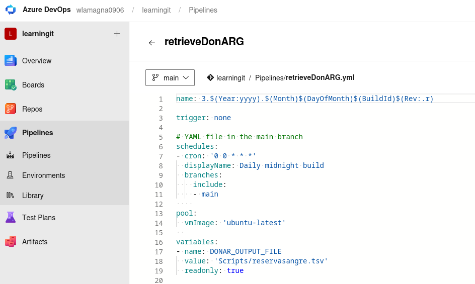
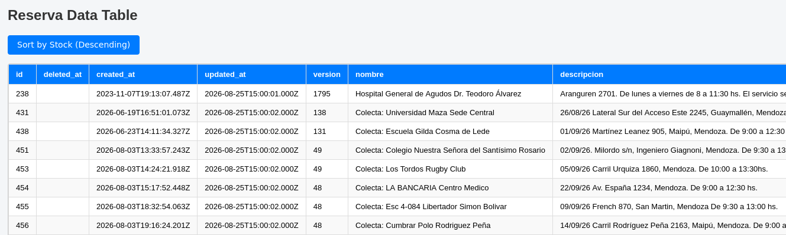

## Blood Availability tracker

### DISCLAIMER: I just crawled the data from this DonARG website and present ir as it is available, and only do some presentations based on the column title.  I take no responsibility for any mis-information and i also recommend to not take any decision with this data.  It is only academic purpose.

### Today was not any other day, today i went to donate blood in the hostpital.
#### The webpage displays a MAP with the amount of blood available, it is difficult to retreive this data because there is no API.  But why
is there no API ? With helps of Some Scripting in Bash + Python plus the Azure Devops Pipelines and Github i created an automation that
runs every night, updates the data file of all the centers for donation, and their information available and then pushes it to github.  Done that
i also have a webpage that displays this info.  Similar to the CertChecker that i created some days ago:

1) Azure Pipeline -> Retrieves Blood Availability Centers -> Transforms the data
2) The pipeline updates the file in its own repository
3) Then it pushes it to the github public repository https://github.com/wlamagna/AzureAccess using a Personal Access Token (It is in a secret)
4) The Report reads this file :
A) Sortable table:
https://htmlpreview.github.io/?https://github.com/wlamagna/Azure/blob/main/ADO/BloodTracker/index.html

B) Sortable bar chart:
https://htmlpreview.github.io/?https://github.com/wlamagna/Azure/blob/main/ADO/BloodTracker/barchart.html

This is the structure of Azure Devops:

Now you can just run this script and have a report and renew the certificate:

### Links:

https://www.donarg.com.ar/

https://www.linkedin.com/company/donarg/

