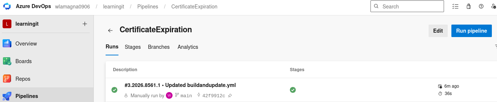
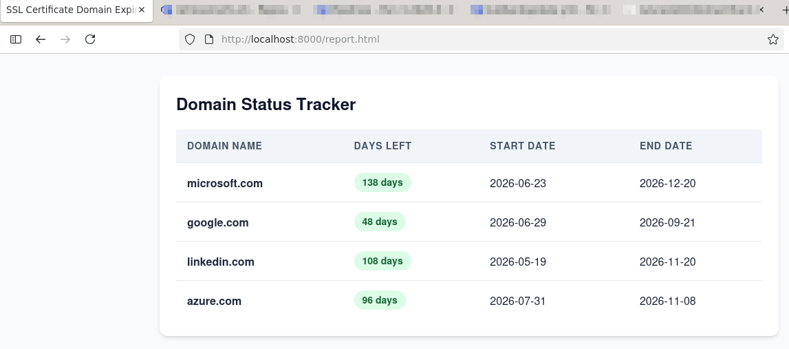

## SSL Certificates Domain Tracker  
### The following story is from a friend of a friend, any similarity with reality is pure coincidence: 
It is a wonderful Sunday, you look outside and imagine going to some beautiful place, 
but suddently you receive a message in the Whatsapp: there is an incident in production, 
they are asking for help, who from prod support is available of if anyone could join 
because users are not able to use the system, and you just do what you have to... you sign-in.
After a few minutes checking logs you realize that it is an expired certificate.  The owner of that process renews the certificate, and all works again.
#### This is a plausible scenario, the root cause analysis is always the same: the domain was not being monitored.

#### Today i am inspired and in a few minutes i created this SSL certs checker.  The best is that i find it elegant, and most important: for free !!
The strategy is the following:

1) Azure Pipeline -> Retrieves certificates 
2) The pipeline updates the file in its own repository
3) Then it pushes it to the github public repository https://github.com/wlamagna/AzureAccess using a Personla Access Token (It is in a secret)
4) The Report reads this file :
https://htmlpreview.github.io/?https://github.com/wlamagna/Azure/blob/main/ADO/DomainTracker/report.html

#### Now you can just run this script and have a report and renew the certificate:

