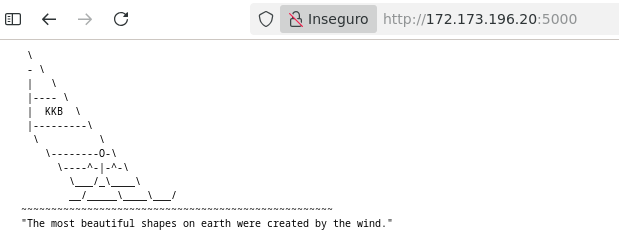

#### An approach to create a two nodes aplication and a single system node aks cluster (for tests).  All from Cloudshell that has already kubectl installed.
```
RGNAME="test01"
REGION="eastus"
VMNAME="vm01"
CONTAINERNAME="playerone"
COSMOSDBNAME="test01account"
ACREGISTRY="acrcordoba"
AKSCLUSTER="aksinior"
KVNAME="kvwc2026"
EMAIL="<YOUR>_hotmail.com#EXT#@<YOUR>.onmicrosoft.com"
SUBID="<YOUR ID>"

echo -n "Creating Resource Group "
az group create -g $RGNAME --location $REGION -o none
if [ $? == 0 ]; then echo "[ok]"; else echo "[x]"; fi;

echo -n "Creating Azure Container Registry "
az acr create --resource-group $RGNAME --name $ACREGISTRY --sku Basic -o none 2>/dev/null
if [ $? == 0 ]; then echo "[ok]"; else echo "[x]"; fi;
```

### First, create the AKS cluster. Every cluster requires a "System" node pool to run core Kubernetes services. To save resources, configure this pool with just 1 small instance.  --node-count specifies the system pool.  if --node-count 3 > creates 3 nodes dedicated to system health. You add a user pool after, with another command>
```
az aks create --resource-group $RGNAME --name $AKSCLUSTER \
--node-count 1 --generate-ssh-keys --attach-acr $ACREGISTRY --node-vm-size Standard_D2s_v7

AKS_ID=$(az aks show --resource-group $RGNAME --name $AKSCLUSTER --query id -o tsv)
ENTRA_OBJECT_ID=$(az ad signed-in-user show --query id -o tsv)
```
#### Grant yourself admin permissions to the cluster using the Azure Kubernetes Service RBAC Cluster Admin role.
```
az role assignment create --role "Azure Kubernetes Service RBAC Cluster Admin" \
--assignee $ENTRA_OBJECT_ID --scope $AKS_ID

az aks nodepool list \
--resource-group $RGNAME \
--cluster-name $AKSCLUSTER \
--query "[].{Name:name, Mode:mode, Status:provisioningState, Count:count}" \
--output table

# az aks nodepool add --resource-group $RGNAME --cluster-name $AKSCLUSTER \
# --name workernodes --node-count 2 --node-vm-size Standard_D2s_v7 --zones 1
```

#### Login the Node:
```
az aks get-credentials --resource-group $RGNAME --name $AKSCLUSTER
# kubectl debug node/aks-nodepool1-33291161-vmss000000 -it --image=mcr.microsoft.com/cbl-mariner/busybox:2.0
# chroot /host
```

#### Lista los nodos System y User
```
kubectl get nodes -o custom-columns=NAME:.metadata.name,STATUS:.status.conditions[-1].type,POOL:.metadata.labels.agentpool,MODE:.metadata.labels."kubernetes\.azure\.com/mode"
```

#### Attach an Azure Container Registry (ACR) - If not attached during creation
```
# az aks update --resource-group $RGNAME --name $AKSCLUSTER --attach-acr $ACREGISTRY
```

#### Here i create the docker file with a VM
```
az acr show --name $ACREGISTRY --query loginServer --output tsv
```

#### Create deployment
```
kubectl create deployment myapp --image=$ACREGISTRY.azurecr.io/playerone:v1
```

#### To access it trough internet - Expose the deployment
```
kubectl expose deployment myapp --type=LoadBalancer --port=80 --target-port=80
```

#### If not port 80 but 5000, delete and recrete the expose:
```
kubectl delete service myapp
kubectl expose deployment myapp --type=LoadBalancer --port=5000 --target-port=5000
```
#### Get the public IP
```
kubectl get service myapp --watch
# Access with http://172.173.196.20:5000
# kubectl scale deployment myapp --replicas=2
```

* Nice picture of two nodes AKS Application:

