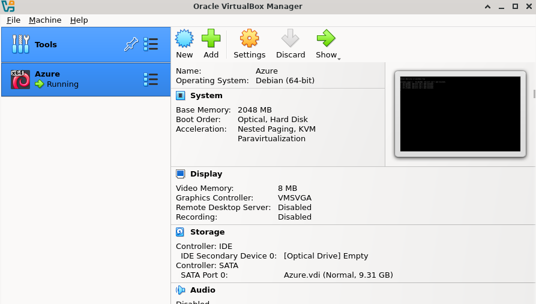

#### These instructions tell how to set up quickly a Linux VM with Docker, create the image and upload it to the Azure Container Registry.  The initial steps are [here](https://github.com/wlamagna/Azure/tree/main/ACI/worldcup2026)
#### Alternativelly, in the bottom of this page are the instructions to just set up a Virtual Box with Docker in your own PC.  This will save you some dollars becasue creating a VM in Azure jsut for the creation of the image can cost some money, not much really.
```
echo -n "Creating the VM with Docker "
az vm create --resource-group $RGNAME --name $VMNAME \
--image Canonical:0001-com-ubuntu-server-jammy:22_04-lts-gen2:latest \
--admin-username azureuser --generate-ssh-keys \
--custom-data cloud-init.txt --size Standard_D2s_v7 -o none 2>/dev/null
if [ $? == 0 ]; then echo "[ok]"; else echo "[x]"; fi;
```

#### Get your Public IP
```
az vm show --resource-group $RGNAME --name $VMNAME  --show-details \
--query publicIps --output tsv
ssh azureuser@<YOUR_PUBLIC_IP>
```

#### Inside the VM:
```
wget https://raw.githubusercontent.com/wlamagna/Azure/refs/heads/main/ACI/worldcup2026/container/Dockerfile
wget https://raw.githubusercontent.com/wlamagna/Azure/refs/heads/main/ACI/worldcup2026/container/app.py
wget https://raw.githubusercontent.com/wlamagna/Azure/refs/heads/main/ACI/worldcup2026/container/requirements.txt
docker build -t playerone:v1 .

docker tag playerone:v1 acrcordoba.azurecr.io/playerone:v1
docker login acrcordoba.azurecr.io --username acrcordoba --password "$ACRPASSWORD"
docker push acrcordoba.azurecr.io/playerone:v1
```

#### Exit the VM back to the Azure CLI and create the instance out of the image:
```
az acr repository list -n $ACREGISTRY -o table
```

#### Completed these steps, you can continue Step 6. [here](https://github.com/wlamagna/Azure/tree/main/ACI/worldcup2026)

#### ---------------
#### These steps are work in progress. Creating the VM with Arm templates.  The strategy must be the following:
### 1. Create the Vnet because:
```
Vnet: Prod-VNet
'-- Subnect: default
       '--- NIC: vm01-nic
              '--- VM: vm01
```

#### First we create the virtual network required by the VM
az deployment group create --resource-group $RG --name newdeploy2025 --template-file arms/vnet.arm

#### Create the Network Interface for the VM
az deployment group create --resource-group $RG --name newdeploy2025v3 --template-file arms/nic.arm

#### Create a VM to Create the Docker files
az deployment group create --resource-group $RG --name newdeploy2025v2 \
--template-file arms/newlinuxvm.arm \
--parameters @arms/newlinuxvm.params

### 1. Create the Linux VM with the Cloud-Init script
```
az vm list-skus --location eastus --size Standard_D --all --output table

## Creating the Virtual Box image


apt-get install apt-transport-https install ca-certificates curl gnupg lsb-release

  - mkdir -p /etc/apt/keyrings
  - apt-get install ca-certificates curl gnupg
  - install -m 0755 -d /etc/apt/keyrings
  - curl -fsSL https://download.docker.com/linux/ubuntu/gpg -o /etc/apt/keyrings/docker.asc
  - chmod a+r /etc/apt/keyrings/docker.asc
  - curl -fsSL https://docker.com | gpg --dearmor -o /etc/apt/keyrings/docker.gpg
  - echo "deb [arch=$(dpkg --print-architecture) signed-by=/etc/apt/keyrings/docker.asc] https://download.docker.com/linux/ubuntu $(. /etc/os-release && echo "$VERSION_CODENAME") stable" | sudo tee /etc/apt/sources.list.d/docker.list > /dev/null
  - apt-get update -y
  - apt-get install -y docker-ce docker-ce-cli containerd.io docker-buildx-plugin docker-compose-plugin
  - usermod -aG docker azureuser


